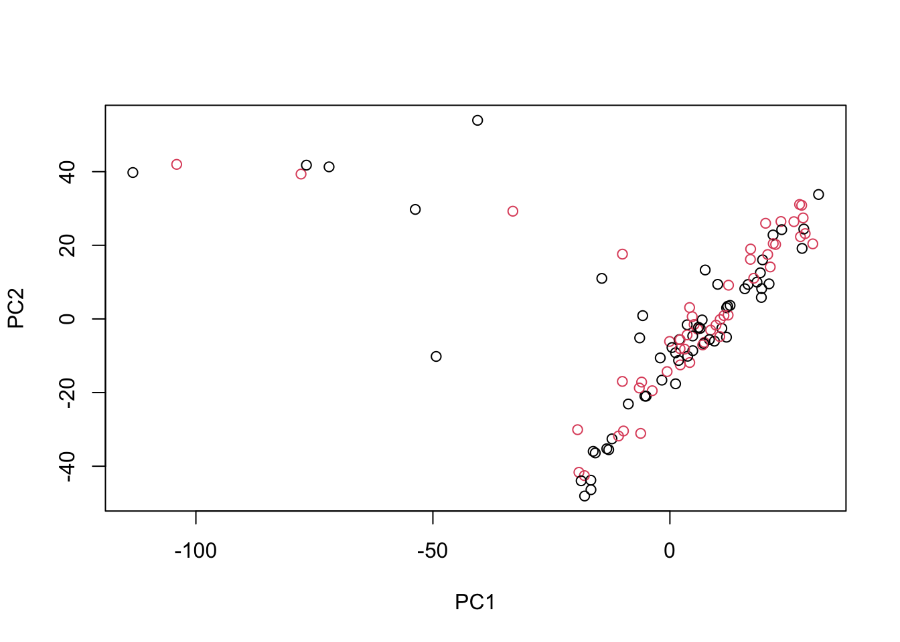
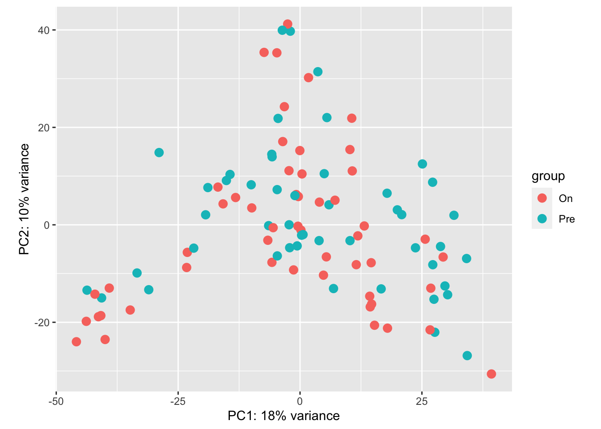

# EDA, QC, and DESeq2 / edgeR analysis of 109 RNA-seq samples of immunotherapy treatment


```r
x <- read.csv("GSE91061_BMS038109Sample.hg19KnownGene.raw.csv.gz", row.names=1)
condition <- factor(sub(".+_(.+)_.+", "\\1", colnames(x)))
table(condition)
```

```
## condition
##  On Pre 
##  58  51
```


```r
library(DESeq2)
dds <- DESeqDataSetFromMatrix(x, 
                              colData=data.frame(condition), 
                              ~condition)
vsd <- vst(dds, blind=FALSE)
plotPCA(vsd)
```


```r
rv <- rowVars(assay(vsd))
pc <- prcomp(t(assay(vsd)[head(order(-rv),1000),]))
plot(pc$x[,1:2], col=condition)
```



```r
idx <- pc$x[,1] < -25
sum(idx)
```

```
## [1] 9
```

```r
plot(pc$x[,1:2], col=idx+1, pch=20, asp=1)
```


```r
condition <- condition[!idx]
dds <- dds[,!idx]
```

For comparison, use minimal filtering with edgeR.


```r
library(edgeR)
y <- DGEList(counts=counts(dds), group=condition)
keep <- filterByExpr(y)
table(keep)
```

```
## keep
## FALSE  TRUE 
##  5956 16231
```

```r
y <- y[keep,]
dds <- dds[keep,]
```

We can see there is still structure in the 2D PCA, which is not
related to the known covariate `condition`.


```r
vsd <- vst(dds, blind=FALSE)
plotPCA(vsd)
```



Run simple DESeq2 analysis comparing the two groups, without 
attempting to control for the technical variation:


```r
system.time({
  dds <- DESeq(dds, test="LRT", reduced=~1, fitType="glmGamPoi")
})
```

```
## estimating size factors
```

```
## estimating dispersions
```

```
## gene-wise dispersion estimates
```

```
## using 'glmGamPoi' as fitType. If used in published research, please cite:
##     Ahlmann-Eltze, C., Huber, W. (2020) glmGamPoi: Fitting Gamma-Poisson
##     Generalized Linear Models on Single Cell Count Data. Bioinformatics.
##     https://doi.org/10.1093/bioinformatics/btaa1009
```

```
## mean-dispersion relationship
```

```
## final dispersion estimates
```

```
## fitting model and testing
```

```
## Fit reduced model
```

```
## Calculate quasi likelihood ratio
```

```
## Prepare results
```

```
##    user  system elapsed 
##  11.694   1.730  14.602
```


```r
res <- results(dds)
table(res$padj < .1)
```

```
## 
## FALSE  TRUE 
## 15392   839
```

Ignoring the technical variation is not appropriate, if there is 
correlation between the technical variation and the condition,
not including variables in the design formula that control for the
effect on the expression estimates will lead to invalid inference,
regardless of the method we choose.

We can estimate the technical variation with a number of methods, 
including RUV, SVA, or PEER. Here we demonstrate usage of RUV:


```r
library(RUVSeq)
set <- newSeqExpressionSet(counts(dds))
set <- betweenLaneNormalization(set, which="upper")
not_sig <- rownames(res)[which(res$pvalue > .1)]
empirical <- rownames(set)[ rownames(set) %in% not_sig ]
set <- RUVg(set, empirical, k=5)
```

The factors of unwanted variation are labelled `W_1`, `W_2`, etc.
and are stored as metadata. We add the original condition variable:


```r
pdat <- pData(set)
pdat$condition <- condition
```

We can visualize how the factors of unwanted variation describe
the samples in the PC1 and PC2 space:


```r
vsd$W1 <- pdat$W_1
vsd$W2 <- pdat$W_2
plotPCA(vsd, intgroup="W1")
```


```r
plotPCA(vsd, intgroup="W2")
```


Adding the factors to the design, and performing a LRT. Here we use
`glmGamPoi` which is an efficient method for estimating dispersion
when we have many samples.


```r
colData(dds) <- cbind(colData(dds), pdat[,1:5])
design(dds) <- ~W_1 + W_2 + W_3 + W_4 + W_5 + condition
```


```r
system.time({
  dds <- DESeq(dds, test="LRT", reduced=~W_1 + W_2 + W_3 + W_4 + W_5, 
               fitType="glmGamPoi")
})
```

```
## using pre-existing size factors
```

```
## estimating dispersions
```

```
## found already estimated dispersions, replacing these
```

```
## gene-wise dispersion estimates
```

```
## using 'glmGamPoi' as fitType. If used in published research, please cite:
##     Ahlmann-Eltze, C., Huber, W. (2020) glmGamPoi: Fitting Gamma-Poisson
##     Generalized Linear Models on Single Cell Count Data. Bioinformatics.
##     https://doi.org/10.1093/bioinformatics/btaa1009
```

```
## mean-dispersion relationship
```

```
## final dispersion estimates
```

```
## fitting model and testing
```

```
## Fit reduced model
```

```
## Calculate quasi likelihood ratio
```

```
## Prepare results
```

```
##    user  system elapsed 
##  23.558   2.016  27.222
```

Controlling for technical variation in this case reduces the number
of DE genes. It could also be the opposite, that controlling for
technical variation increased the apparent number of DE genes.
That the number is reduced here indicates that some of the previous
results were likely due to confounding of technical variation with
the condition variable. Ignoring that confounding, again, will result
in invalid inference for all methods.


```r
res <- results(dds)
table(res$padj < .1)
```

```
## 
## FALSE  TRUE 
## 16212    19
```


```r
res_sig <- res[which(res$padj < .1),]
```


```r
DESeq2::plotMA(res, ylim=c(-5,5))
```


```r
y <- calcNormFactors(y)
design <- model.matrix(~W_1 + W_2 + W_3 + W_4 + W_5 + condition, data=pdat)
y <- estimateDisp(y, design)
qlfit <- glmQLFit(y, design)
qlft <- glmQLFTest(qlfit)
```


```r
tt <- topTags(qlft, n=nrow(y))[[1]]
sum(tt$FDR < .1)
```

```
## [1] 0
```


```r
hist(tt$F, freq=FALSE)
F <- tt[rownames(res_sig),"F"]
lines(density(F[!is.na(F)]))
```


```r
match(rownames(res_sig), rownames(tt))
```

```
##  [1]  8 12  7  3  2 15 14 13  4  1 11 18  6 19  5 16  9 21 17
```


```r
table(rownames(res_sig) %in% head(rownames(tt), 20))
```

```
## 
## FALSE  TRUE 
##     1    18
```

We can see that DESeq2 tends to have smaller p-values on this dataset
but the two methods agree on the ranking:


```r
res_top500 <- res[head(order(res$pvalue),500),]
plot(-log10(tt[rownames(res_top500),"PValue"]), 
     -log10(res_top500$pvalue), log="xy",
     xlab="edgeR pvalue", ylab="DESeq2 pvalue")
abline(0,1,col="red")
```


# Session info


```r
sessionInfo()
```

```
## R version 4.1.2 (2021-11-01)
## Platform: x86_64-apple-darwin17.0 (64-bit)
## Running under: macOS Big Sur 10.16
## 
## Matrix products: default
## LAPACK: /Library/Frameworks/R.framework/Versions/4.1/Resources/lib/libRlapack.dylib
## 
## locale:
## [1] en_US.UTF-8/en_US.UTF-8/en_US.UTF-8/C/en_US.UTF-8/en_US.UTF-8
## 
## attached base packages:
## [1] stats4    stats     graphics  grDevices utils     datasets  methods   base     
## 
## other attached packages:
##  [1] RUVSeq_1.28.0               EDASeq_2.28.0               ShortRead_1.52.0           
##  [4] GenomicAlignments_1.30.0    Rsamtools_2.10.0            Biostrings_2.62.0          
##  [7] XVector_0.34.0              BiocParallel_1.28.3         edgeR_3.36.0               
## [10] limma_3.50.1                DESeq2_1.34.0               SummarizedExperiment_1.24.0
## [13] Biobase_2.54.0              MatrixGenerics_1.6.0        matrixStats_0.61.0         
## [16] GenomicRanges_1.46.1        GenomeInfoDb_1.30.1         IRanges_2.28.0             
## [19] S4Vectors_0.32.3            BiocGenerics_0.40.0         testthat_3.1.2             
## [22] rmarkdown_2.11              devtools_2.4.3              usethis_2.1.5              
## 
## loaded via a namespace (and not attached):
##   [1] colorspace_2.0-3          rjson_0.2.21              hwriter_1.3.2            
##   [4] ellipsis_0.3.2            rprojroot_2.0.2           fs_1.5.2                 
##   [7] farver_2.1.0              remotes_2.4.2             bit64_4.0.5              
##  [10] AnnotationDbi_1.56.2      fansi_1.0.2               xml2_1.3.3               
##  [13] codetools_0.2-18          R.methodsS3_1.8.1         splines_4.1.2            
##  [16] sparseMatrixStats_1.6.0   cachem_1.0.6              geneplotter_1.72.0       
##  [19] knitr_1.37                pkgload_1.2.4             jsonlite_1.8.0           
##  [22] annotate_1.72.0           dbplyr_2.1.1              R.oo_1.24.0              
##  [25] png_0.1-7                 compiler_4.1.2            httr_1.4.2               
##  [28] assertthat_0.2.1          Matrix_1.4-0              fastmap_1.1.0            
##  [31] cli_3.2.0                 htmltools_0.5.2           prettyunits_1.1.1        
##  [34] tools_4.1.2               gtable_0.3.0              glue_1.6.2               
##  [37] GenomeInfoDbData_1.2.7    dplyr_1.0.8               rappdirs_0.3.3           
##  [40] Rcpp_1.0.8                jquerylib_0.1.4           vctrs_0.3.8              
##  [43] rtracklayer_1.54.0        DelayedMatrixStats_1.16.0 xfun_0.29                
##  [46] stringr_1.4.0             ps_1.6.0                  brio_1.1.3               
##  [49] lifecycle_1.0.1           restfulr_0.0.13           XML_3.99-0.9             
##  [52] MASS_7.3-55               zlibbioc_1.40.0           scales_1.1.1             
##  [55] aroma.light_3.24.0        hms_1.1.1                 parallel_4.1.2           
##  [58] RColorBrewer_1.1-2        curl_4.3.2                yaml_2.3.5               
##  [61] memoise_2.0.1             ggplot2_3.3.5.9000        sass_0.4.0               
##  [64] biomaRt_2.50.3            latticeExtra_0.6-29       stringi_1.7.6            
##  [67] RSQLite_2.2.10            highr_0.9                 genefilter_1.76.0        
##  [70] BiocIO_1.4.0              desc_1.4.0                GenomicFeatures_1.46.5   
##  [73] filelock_1.0.2            pkgbuild_1.3.1            rlang_1.0.1              
##  [76] pkgconfig_2.0.3           bitops_1.0-7              evaluate_0.15            
##  [79] lattice_0.20-45           glmGamPoi_1.6.0           purrr_0.3.4              
##  [82] labeling_0.4.2            bit_4.0.4                 processx_3.5.2           
##  [85] tidyselect_1.1.2          magrittr_2.0.2            R6_2.5.1                 
##  [88] generics_0.1.2            DelayedArray_0.20.0       DBI_1.1.2                
##  [91] pillar_1.7.0              withr_2.4.3               survival_3.2-13          
##  [94] KEGGREST_1.34.0           RCurl_1.98-1.6            tibble_3.1.6             
##  [97] crayon_1.5.0              utf8_1.2.2                BiocFileCache_2.2.1      
## [100] progress_1.2.2            jpeg_0.1-9                locfit_1.5-9.4           
## [103] grid_4.1.2                blob_1.2.2                callr_3.7.0              
## [106] digest_0.6.29             xtable_1.8-4              R.utils_2.11.0           
## [109] munsell_0.5.0             bslib_0.3.1               sessioninfo_1.2.2
```
